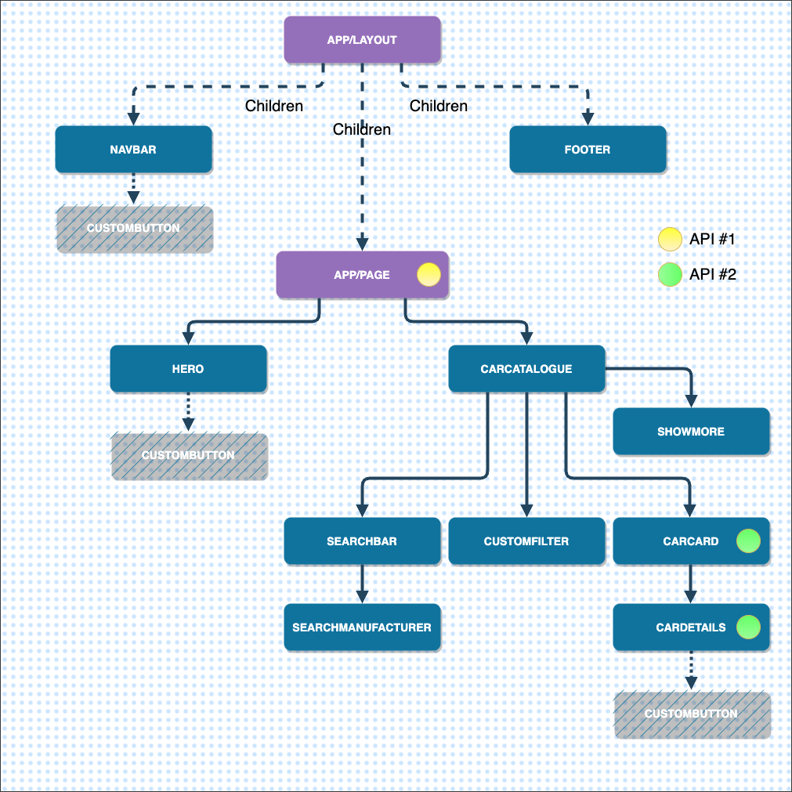

## Car Showcase Hub
Next.js 13 app under Node v16.13.2

### Goals & Functionalities:

- Next.js Server Side Rendering feature
- Organized file & folder structure
- Application routes implementation
- Search & Filtering capabilities
- Data display in chunks
- Combobox & Modal elements
- Transitioning from CSR to SSR
- Optimizing metadata & SEO
- Mobile responsiveness

### Tech stack:

- [Tailwind CSS](https://tailwindcss.com/docs/guides/nextjs) guide
- [Headless UI](https://headlessui.com/) documentation
- [Rapid API](https://rapidapi.com/apininjas/api/cars-by-api-ninjas) api #1
- [Car Images](https://www.imagin.studio/car-image-api) api #2

### Project setup: 

```bash
npx create-next-app@latest ./
```
- Typescript: Y
- ESLint: N
- Tailwind: Y
- src directory: N
- App router: Y
- import alias: N  

### Run dev server:

```bash
npm run dev
```

### Deployment:

[Project deployed](http://my-car-showcase.vercel.app) on Vercel

### Important info:

Every page and component in Next.js are Server Side Rendered, meaning the data is fetched directly on the server.
SSR components can be converted into CSR components by applying "use client" (for all the browser events).

### Component Structure:

